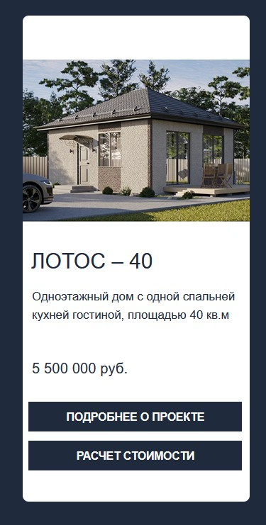
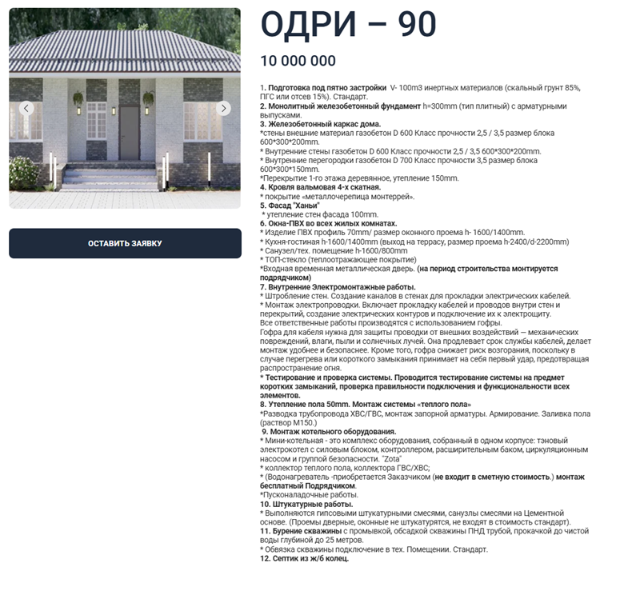

# Введение

Основной целью разработки является создание опросного модуля, который поможет посетителю сайта быстрее определить подходящий проект дома, исходя из его потребностей и предпочтений.

Актуальность работы обусловлена тем, что сайт строительной компании **ALEX GROUP** уже содержит каталог проектов домов, а также карточки отдельных домов с ценой, площадью и характеристиками. На сайте представлены проекты с различными параметрами, а в карточках указываются площадь дома, количество этажей и спален, а также сведения о конструктивных решениях и комплектации. При этом подбор подходящего проекта в основном осуществляется за счет самостоятельного просмотра каталога, что неудобно для пользователя, особенно если он еще не определился с желаемыми характеристиками будущего дома.

Пользователь будет последовательно отвечать на несколько вопросов, после чего система автоматически предложит наиболее подходящие проекты домов. Это позволит сократить время, а также снизить вероятность ухода посетителя с сайта.

## Функциональные возможности разрабатываемого модуля

1. Прохождение пользователем опроса из нескольких вопросов.
2. Автоматический подбор подходящих проектов дома на основе ответов.
3. Вывод пользователю списка наиболее подходящих проектов.
4. Возможность скачать PDF-файл с описанием проекта, комплектацией, стоимостью и контактами менеджера.
5. Сохранение результатов опроса для последующего анализа интересов посетителей сайта.

Функциональность модуля направлена на повышение удобства взаимодействия пользователя с сайтом строительной компании. Посетителю не потребуется самостоятельно просматривать большое количество карточек проектов и искать нужные. Вместо этого система предложит уже отобранные варианты, наиболее соответствующие введенным критериям.

С технической точки зрения разрабатываемое решение представляет собой веб-модуль, который можно встроить в существующий сайт компании. Его логика будет включать обработку ответов пользователя, сопоставление их с параметрами проектов, формирование результата подбора и подготовку PDF-документа на основе данных выбранного проекта.

# Глава 1. Обзор предметной области

## 1.1 Описание предметной области

Когда пользователь заходит на сайт, он сталкивается с несколькими параметрами, которые необходимо учитывать: площадь дома, этажность, количество комнат, особенности планировки, тип конструкций, стоимость и другие характеристики. Если все проекты представлены единым списком или каталогом, посетителю приходится самостоятельно просматривать большое количество вариантов, что усложняет принятие решения.

На главной странице компании представлены проекты домов и переходы к их подробному описанию, а в карточках плана содержатся цена и базовые сведения о проекте.

На отдельных страницах проектов указывается подробная информация о проекте.

Однако при большом количестве вариантов пользователю сложно сразу понять, какой проект подходит именно ему. Поэтому нужен инструмент подбора проекта, чтобы пользователь не просматривал каждую карточку, а выбирал из наиболее подходящих ему.

Таким образом, разрабатываемый модуль должен помочь пользователю быстрее находить подходящие решения среди большого числа проектов и сделать выбор более удобным.

## 1.2 Описание существующих решений

### 1.2.1 Описание сервиса «Marquiz»

**Marquiz** — это онлайн-конструктор маркетинговых квизов и форм сбора контактов для сайта. Сервис позволяет без участия программиста и дизайнера создавать формы и квизы, встраивать их на сайт разными способами и подключать интеграции с CRM, сервисами рассылок и системами аналитики. Сервис имеет **500+ интеграций**, а также возможность подключения популярных CRM, включая **amoCRM**, **Битрикс24** и другие системы.

### 1.2.2 Описание сервиса «QuizGo»

**QuizGo** — это конструктор маркетинговых квизов, предназначенный для быстрого создания квиз-опросов для сайта. Квиз можно собрать самостоятельно без дизайнера и программиста, а также встроить на сайт. Сервис поддерживает интеграции с CRM-системами **amoCRM** и **Битрикс24**.

### 1.2.3 Описание сервиса «Envybox»

**Envybox** предлагает квиз как встраиваемый инструмент для сайта, ориентированный на привлечение пользователей. Опрос интегрируется с сервисами аналитики и маркетинга, такими как **Яндекс.Метрика**, **Google Analytics**, **Telegram**, а также CRM-системами. Также сервис поддерживает персональные настройки квиза.

### 1.2.4 Анализ существующих решений

Для рассмотренных сервисов был выполнен сравнительный анализ с разрабатываемым решением по следующим критериям:

1. Наличие квиз-опроса для сайта.
2. Возможность встраивания в существующий сайт.
3. Интеграция с CRM-системами.
4. Интеграция с аналитическими сервисами.
5. Сбор ответов и контактных данных пользователя.
6. Специализация именно под подбор проекта дома.
7. Работа с собственной базой проектов сайта.
8. Возможность скачать PDF с описанием проекта.
9. Возможность дальнейшего анализа интересов посетителей.

В результате анализа была составлена следующая таблица:

| Функционал                                            | Marquiz | QuizGo | Envybox | Наше решение |
| ----------------------------------------------------- | ------- | ------ | ------- | ------------ |
| Наличие квиз-опроса для сайта                         | +       | +      | +       | +            |
| Возможность встраивания в существующий сайт           | +       | +      | +       | +            |
| Интеграция с CRM-системами                            | +       | +      | +       | -            |
| Интеграция с аналитическими сервисами                 | +       | + / -  | +       | -            |
| Сбор ответов и контактных данных пользователя         | +       | +      | +       | \_           |
| Специализирован именно под подбор проекта дома        | -       | -      | -       | +            |
| Работа с собственной базой проектов сайта             | -       | -      | -       | +            |
| Возможность скачать PDF с описанием проекта           | -       | -      | -       | +            |
| Возможность дальнейшего анализа интересов посетителей | +       | +      | +       | +            |

Таблица показала, что данные решения в первую очередь ориентированы на универсальные платформы, а не на специализированный подбор проекта дома на основе внутреннего каталога компании.
